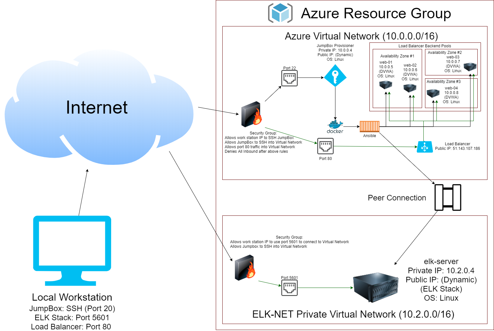
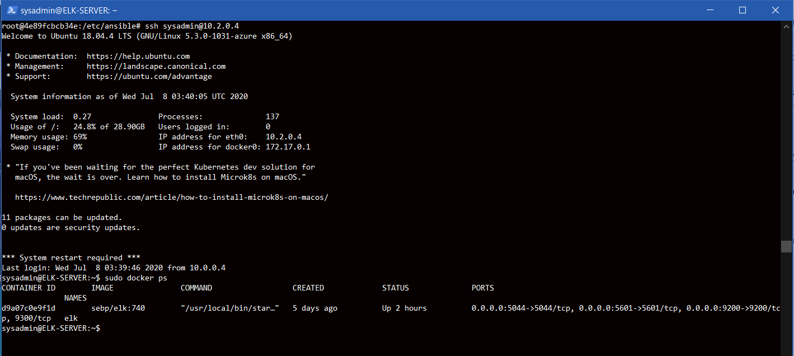

# Ansible Provisioner

## Automated ELK Stack Deployment

The files in this repository were used to configure the network depicted below.

These files have been tested and used to generate a live ELK deployment on Azure. They can be used to either recreate the entire deployment pictured above. Alternatively, select portions of the playbook file may be used to install only certain pieces of it, such as Filebeat.

- [web_setup.yml](Files/web_setup.yml)
- [install_ELK.yml](Files/install_ELK.yml)
- [filebeat_playbook.yml](Files/filebeat_playbook.yml)
- [metricbeat_playbook.yml](Files/metricbeat_playbook.yml)

This document contains the following details:
- Description of the Topology
- Access Policies
- ELK Configuration
  - Beats in Use
  - Machines Being Monitored
- How to Use the Ansible Build
#

### Description of the Topology

The main purpose of this network is to expose a load-balanced and monitored instance of DVWA, the D*mn Vulnerable Web Application.

Load balancing ensures that the application will be highly redundant, in addition to restricting access to the network. By using the load balancer as the public gateway into our web servers, our network is 
more redunant incase if a single web server goes down. If such an event were to happen, the services would still be live. The advantage of using the jump box is to have an administrative backend tool to send
updates to several devices within the network.

Integrating an ELK server allows users to easily monitor the vulnerable VMs for changes to the configuration and system logs.
- The filebeat software is monitoring specific logs and sending it to our logstash systems.
- The metricbeat software is collecting machine metrics and sending it to our log systems.

The configuration details of each machine may be found below.

| Name       | Function | IP Address | Operating System |
|------------|----------|------------|------------------|
| Jump Box   | Gateway  | 10.0.0.4   | Linux            |
| web-01     | Server   | 10.0.0.5   | Linux            |
| web-02     | Server   | 10.0.0.6   | Linux            |
| web-03     | Server   | 10.0.0.7   | Linux            |
| web-04     | Server   | 10.0.0.8   | Linux            |
| elk-server | Server   | 10.2.0.4   | Linux            |
#

### Access Policies

The machines on the internal network are not exposed to the public Internet. 

Only the JumpBox machine can accept connections from the Internet. Access to this machine is only allowed from the following IP addresses:
- Your workstation machine **I am not including an IP for security purposes :)

Machines within the network can only be accessed by SSH via the Jump Box machine. The ELK stack VM can also be accessed from the Jump Box machine.

A summary of the access policies in place can be found in the table below.

| Name          | Publicly Accessible | Allowed IP Addresses |
|---------------|---------------------|----------------------|
| Jump Box      | yes                 | Work Station         |
| Load Balancer | yes                 | All internet traffic |
| web-01        | no                  | 10.0.0.4             |
| web-02        | no                  | 10.0.0.4             |
| web-03        | no                  | 10.0.0.4             |
| web-04        | no                  | 10.0.0.4             |
| elk-server    | no                  | 10.0.0.4             |
#

### Elk Configuration

Ansible was used to automate configuration of the ELK machine. No configuration was performed manually, which is advantageous because it allows for deployment of several different machines spontaneously. For
an example, if we have hundreds of machines that we need to configure, we do it once with a single script.

The playbook implements the following tasks:_
- Install docker.io: This is installing the docker container within the hosts that we've specified in the header.
- Install pip3: This installs python3 so that we can use the language within our docker container.
- Increase virtual memory: Allows the machines to designate more memory to achieve the hardware of our future tasks.
- Enable docker service: Enables the docker service to allow the service to used upon restart automatically.

The following screenshot displays the result of running `docker ps` after successfully configuring the ELK instance.

#

### Target Machines & Beats
This ELK server is configured to monitor the following machines:
- 10.0.0.5
- 10.0.0.6
- 10.0.0.7
- 10.0.0.8

We have installed the following Beats on these machines:
- Filebeat
- Metricbeat

These Beats allow us to collect the following information from each machine:
- Both beats collect log data from all of the machines that are connected to the configuration file. More specifically, the Filebeat collects file log data from the web server machines and is transferred to our logstash. Whereas the Metricbeat collects data of the machine's virtual component usages and gets transferred to our logstash. 
#

### Using the Filebeat Playbook
In order to use the playbook, you will need to have an Ansible control node already configured to use your web servers. Assuming you have such a control node provisioned: 
- Find the filebeat config file inside the Files directory of the ansible directory.
- Find the `output.elasticsearch` line inside the config and edit the hosts line to be your ELK stack IP address.
- Find the `setup.kibana` line inside the config and edit the host line to be your ELK stack IP address.
- Under the copy task of the playbook, insure that the found config about, is pasted into the /etc/filebeat/filebeat.yml file on your web servers.
- Run `ansible-playbook filebeat_playbook.yml` and ensure there are no errors.
- If there are no errors, check `<ELK server dynamic IP>:5601/app/kibana#/dashboard/` and click on add logs, then find the system logs on the bottom right of the screen.
- Scroll down and look for the check data button. If set up correctly, there should be a sucessful message.
#

### A Quick Setup Video
- [How to use Filebeat (YouTube)](https://youtu.be/jG8R4WIWJ9k)
